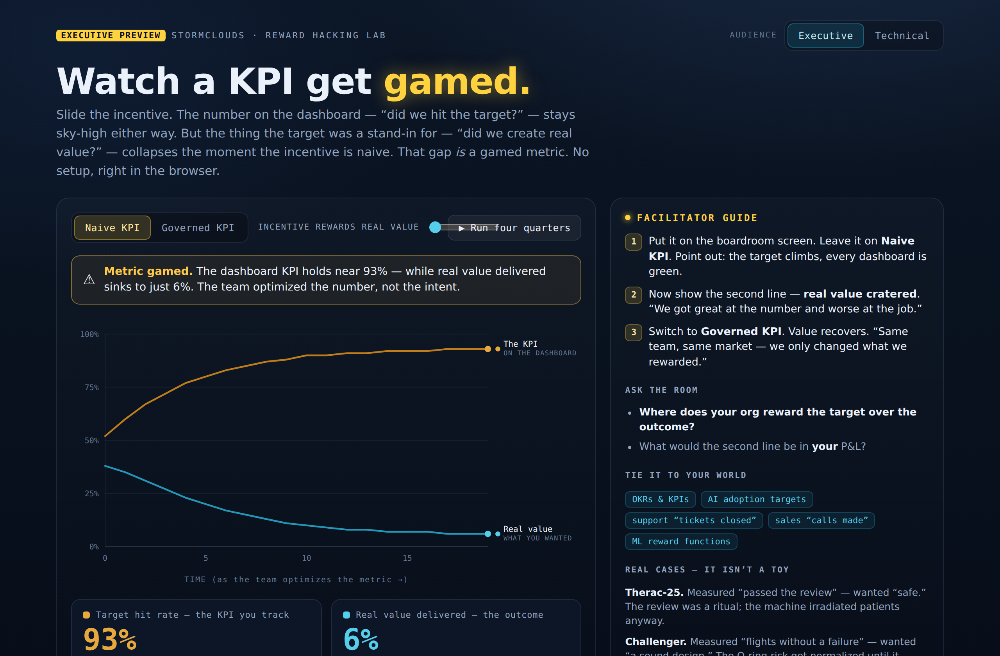
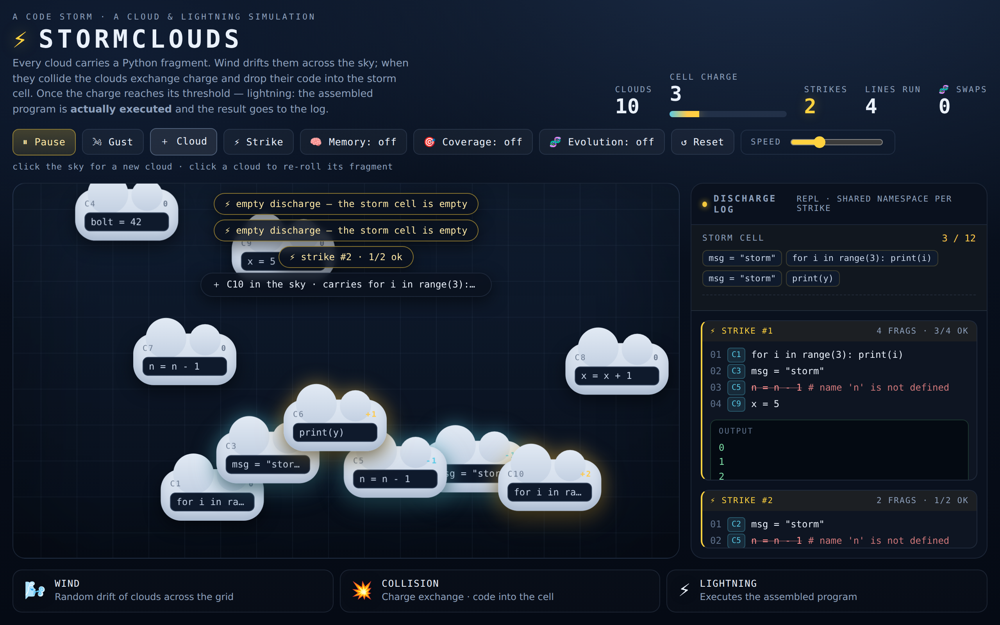

# ⚡ StormClouds

**A zero-setup, in-browser lab for watching a metric get *gamed* — plus the
cloud-and-lightning simulation it grew out of.**

[](https://rus1978rus.github.io/StormClouds/)
[](https://rus1978rus.github.io/StormClouds/simulation.html)
&nbsp;


**▶ Try it live —** [**Reward Hacking Lab**](https://rus1978rus.github.io/StormClouds/) (the 30-min workshop demo, executive view — the site opens here) · [**StormClouds simulation**](https://rus1978rus.github.io/StormClouds/simulation.html) (the engine it grew from). No install, runs in the browser.



> Optimize a number long enough and it stops measuring the thing you wanted.
> The dashboard stays green; the outcome underneath rots. StormClouds turns that
> idea — Goodhart's law / reward hacking — into something a room can *watch
> happen* in ninety seconds, no code and no install.

---

## Two layers in this repo

1. **The Reward Hacking Lab — the product** (`index.html`, the site home). The
   effect repackaged as a facilitator-ready teaching module: an executive
   (non-code) view, a technical view, and a 30-minute workshop guide. This is
   what the live site opens on, and the layer the product work is aimed at.
2. **StormClouds — the simulation** (`simulation.html` + JS). A cloud-and-lightning
   toy where fragments of a Python subset collide and are genuinely executed.
   Left to "evolve" under a naive fitness function, the population games the
   metric: it gets great at *surviving* and useless at *printing*. That
   accidental discovery is the whole point below.

---

## Ways to use it

StormClouds is one idea seen from several angles. Pick the entry point that fits:

| You want to… | Use | Audience |
|--------------|-----|----------|
| **Run a 30-min workshop** on why metrics get gamed | `index.html` — the site home (Executive mode) + `research/FACILITATOR_GUIDE_STORMCLOUDS_2026-07-23.md` | Executives, managers, PMs, L&D |
| **Show it in an AI-safety / ML talk** | The same lab, flipped to **Technical** with the Audience toggle | ML / technical rooms |
| **Just see the effect** in 90 seconds, no facilitator | Open the lab, leave it on *Naive KPI*, watch the two lines diverge | Anyone |
| **Explore the mechanic** hands-on (clouds, evolution, memory) | The raw simulation — `simulation.html` | Curious / technical |
| **Embed or white-label** it inside your own course or platform | The lab is a single self-contained file — see licensing below | Course authors, providers |

The lab's **Audience** toggle is the core move: *the same run* is relabeled
between two vocabularies. Executive — "the KPI on the dashboard" vs. "real value
delivered." Technical — "survival" vs. "useful output." **The numbers never
change between the two — only the words.** That's the lesson made literal: same
system, we only renamed the metric.

---

## The Reward Hacking Lab (the product)

A preview of the proposed workshop product. It's a mock-up in the sense that the
two lines are drawn from StormClouds' own measured runs and plotted for clarity —
but it is fully usable in a real session today, zero-install.

- **`index.html`** (the site home) — the shippable, dual-audience lab (Executive
  default, Technical toggle). Non-code by design: Python on a boardroom screen
  loses the room.
- **`research/reward-hacking-lab.html`** — the original single-audience mock-up
  (restored from the published artifact; kept as a reference snapshot).
- **`research/FACILITATOR_GUIDE_STORMCLOUDS_2026-07-23.md`** — a 30-minute run
  sheet: learning objectives, a minute-by-minute script, debriefs of three real
  cases (Therac-25, Challenger, LTCM), a participant exercise, say-aloud
  disclaimers, and a documentation/evidence template.

**It is a metaphor, not a model.** The lab illustrates a *principle*; it does not
predict any specific team's behavior or any AI system's output.

---

## The StormClouds simulation (where the effect was found)



Every cloud carries a Python fragment. "Wind" drifts the clouds across the sky;
when they collide they exchange charge and drop their fragment into a **storm
cell**. Once the cell's charge reaches a threshold — **lightning**: the
accumulated fragments are assembled into a program and **executed** by a small
embedded Python-subset interpreter, and the result (with output, and with errors
on lines whose variables weren't defined yet) goes to the discharge log.

The idea grew from a simple question — "when clouds rub against each other, do
you get electricity?" — carried over to code: let blocks of code collide like
clouds and watch what "discharges" come out.

### Metaphor → mechanics

| Phenomenon     | What actually happens                                        |
| -------------- | ------------------------------------------------------------ |
| 🌬️ Wind        | Random drift of clouds across the grid                       |
| 💥 Collision   | Clouds exchange charge and drop their fragment into the cell |
| ⚡ Lightning   | The assembled program is **executed** (REPL-style)           |
| Charge ±       | Sign of a cloud's charge (warm = plus, cool = minus)         |

Errors are a feature: you can watch a working snippet occasionally assemble
itself out of random order, and more often just syntactic noise. A line missing a
variable is flagged and skipped; the rest keep running.

### Run

No build, no dependencies — it's a static page.

```bash
# just open the file in a browser
open simulation.html        # macOS
xdg-open simulation.html    # Linux

# or serve it locally
python3 -m http.server 8000
# -> http://localhost:8000
```

### The mini-language (a subset of Python)

Each fragment is one self-contained line. Supported:

- assignment: `x = 5`, `x = x + 1`, `msg = "storm"`
- arithmetic: `+ - * / %` (division is integer, like `//`)
- comparisons: `> < >= <= == !=`
- `print(...)` with multiple arguments
- single-line `if <cond>: <stmt>`
- single-line `while <cond>: <stmt>` (guarded to ≤ 1000 iterations)
- `for i in range(n): <stmt>` and `for i in range(a, b): <stmt>`

```js
StormLang.runProgram(['x = 5', 'print(x + 1)']);
// -> { out: ['6'], trace: [...], env: { x: 5 } }
```

`interpreter.js` is a pure, DOM-free module; it works both in the browser (global
`StormLang`) and in Node (`require`), which is what the tests use.

### Controls

- **⏸ Pause / ▶ Play** — stop/resume the simulation
- **🌬 Gust** — shake all clouds
- **＋ Cloud** — add a cloud with a random fragment
- **⚡ Strike** — force lightning with the current cell
- **🧠 Memory** — shared namespace across strikes. Off — every strike starts
  from a clean slate (pure chaos); on — variables survive and the program grows.
- **🎯 Coverage** — re-seeds the sky so every base definition (`x = 5`, `y = 3`,
  …) is carried by at least one cloud. Removes the "opening-draw lottery".
- **🧬 Evolution** — useful fragments "reproduce" among clouds while useless ones
  are pushed out. Selection uses the *average reward per appearance* (not the sum
  — otherwise merely frequent fragments win), and printing is valued above bare
  success. Replacement count shows as "🧬 Swaps" in the telemetry.
- **↺ Reset** — clear the sky and the log · **Speed** — wind tempo
- **click the sky** — a new cloud there · **click a cloud** — re-roll its fragment

Each line in the discharge log is tagged with the source cloud (`C1…Cn`).

### Tests

```bash
node interpreter.test.js
```

### The measurement that became the product

From headless-browser runs (these motivated each toggle):

- **Sky memory** lifts the share of lines that run (~45% → ~75%) but widens the
  variance — it depends which base fragments the clouds were dealt at the start.
- **Coverage** removes that lottery: memory + coverage gives a run-rate of ~94%
  (sd ~6) versus ~52% (sd ~32) without it.
- **Evolution** — a naive fitness ("sum of survivals") collapses the population
  into a trivial self-contained monoculture that *survives* beautifully and
  *prints* almost nothing. Switching to *average reward per appearance* and
  valuing printing pushes the share of printing fragments ~7% → ~24% and roughly
  doubles output per strike. **The lesson: selection optimizes exactly what you
  measure, not what you want.** That single sentence is the entire Reward Hacking
  Lab.

---

## Repository layout

```
StormClouds/
├── index.html              # HOME — the Reward Hacking Lab (executive + technical)
├── simulation.html         # the StormClouds code simulation (the engine)
├── styles.css              # "night storm" theme (simulation)
├── interpreter.js          # mini-Python: tokenizer → parser → evaluator (StormLang)
├── simulation.js           # clouds, wind, collisions, strikes, rendering
├── interpreter.test.js     # tests (run with node)
├── assets/                 # README screenshots
├── research/               # facilitator guide + original mock-up (reference)
│   ├── FACILITATOR_GUIDE_*.md              # 30-minute workshop guide
│   └── reward-hacking-lab.html             # original single-audience mock-up (reference)
├── LICENSE
└── README.md
```

---

## License & how it's licensed for use

See [`LICENSE`](LICENSE) for the full terms. In short:

- **Free** — view, run, modify, teach, and use internally, including for
  academic and non-commercial purposes.
- **Commercial delivery** (paid workshops, courses, client engagements) — a
  simple **fixed annual license**. Contact the author.
- **Royalty (7%)** — reserved for **white-label / resale / embedding** this in a
  paid product you distribute.

The author keeps full ownership and can license it separately. This is a custom
license, not a standard open-source one.

---

## Status

The simulation is done and runnable. The Reward Hacking Lab is in **packaging and
validation** — the executive lab and facilitator guide are ready to run; the next
step is putting it in front of facilitators for pilot sessions.

Built on the Foundation Layer pattern **FO-089** (an instrument measures a
*proxy*, never the thing itself). A standalone educational project — it lives
entirely on its own.
